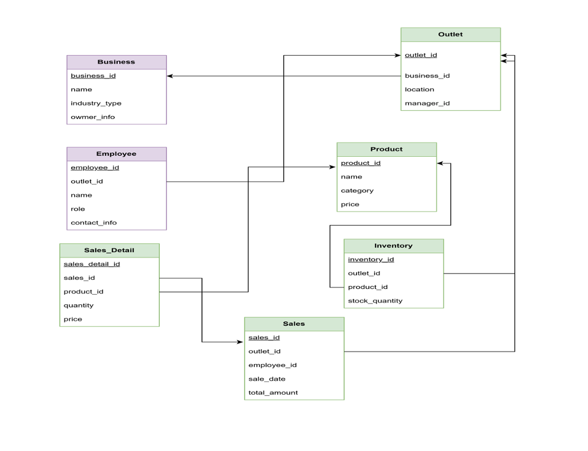
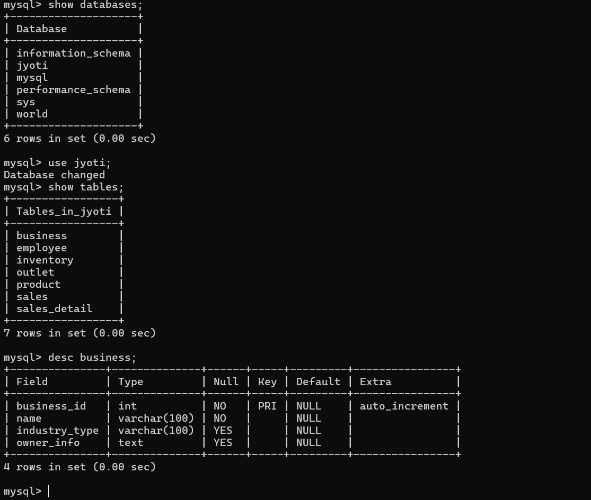

### Schema Diagram

---

### Tables and Attributes

#### 🏢 Business  
**Attributes:**  
- `business_id` *(Primary Key)*  
- `name`  
- `industry_type`  
- `owner_info`  

#### 🏬 Outlet  
**Attributes:**  
- `outlet_id` *(Primary Key)*  
- `business_id` *(Foreign Key → Business)*  
- `location`  
- `manager_id`  

#### 👨‍💼 Employee  
**Attributes:**  
- `employee_id` *(Primary Key)*  
- `outlet_id` *(Foreign Key → Outlet)*  
- `name`  
- `role`  
- `contact_info`  

#### 📦 Product  
**Attributes:**  
- `product_id` *(Primary Key)*  
- `name`  
- `category`  
- `price`  

#### 🧮 Inventory  
**Attributes:**  
- `inventory_id` *(Primary Key)*  
- `outlet_id` *(Foreign Key → Outlet)*  
- `product_id` *(Foreign Key → Product)*  
- `stock_quantity`  

#### 💰 Sales  
**Attributes:**  
- `sales_id` *(Primary Key)*  
- `outlet_id` *(Foreign Key → Outlet)*  
- `employee_id` *(Foreign Key → Employee)*  
- `sale_date`  
- `total_amount`  

#### 🧾 Sales_Detail  
**Attributes:**  
- `sales_detail_id` *(Primary Key)*  
- `sales_id` *(Foreign Key → Sales)*  
- `product_id` *(Foreign Key → Product)*  
- `quantity`  
- `price`

